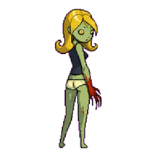
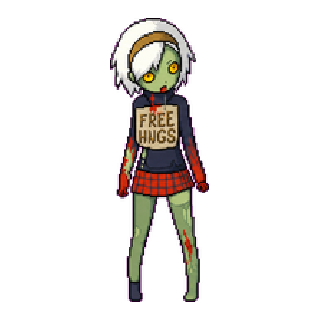
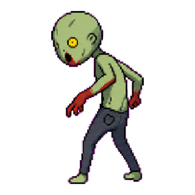
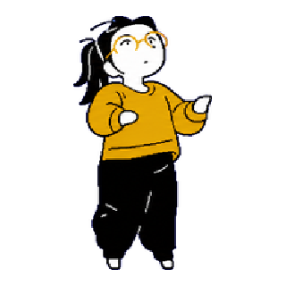
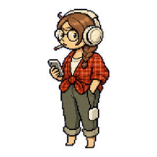
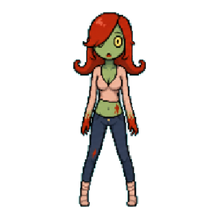
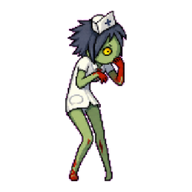

# 🇺🇦 HELP UKRAINE

We fight for democratic values, for freedom, for our future. We need your support. 
Solidarity with the Ukrainian people against the Russian invasion [Find out how you can help.](https://war.ukraine.ua/support-ukraine/).

# Codex Pets

I wanted Codex to feel more personal and alive while I work. A small animated companion makes the workspace feel less sterile, adds a bit of personality to long coding sessions, and turns the app into something that feels like mine instead of just another tool.

These pets are intentionally simple: a manifest, a spritesheet, and a tiny character idea.

## Pets

| Pet | Description |
| --- | --- |
| <a href="blonde-zombie/README.md"> Blonde Zombie</a> | A quiet blonde zombie with simple slow motions. |
| <a href="free-hugs-zombie/README.md"> Free Hugs Zombie</a> | A shy little zombie in a Free Hugs sign shirt. |
| <a href="hunched-zombie/README.md"> Hunched Zombie</a> | A hunched green zombie with slow thinking motions. |
| <a href="mustard-listener/README.md"> Mustard Listener</a> | A calm ponytailed listener in a mustard sweater with simple thoughtful motions. |
| <a href="plaid-listener/README.md"> Plaid Listener</a> | A cozy headphone listener with simple thoughtful motions. |
| <a href="red-hair-zombie/README.md"> Red-Hair Zombie</a> | A quiet red-haired zombie with simple slow motions. |
| <a href="zombie-medsister/README.md"> Zombie Medsister</a> | A shy zombie medical sister with slow nervous motions. |
